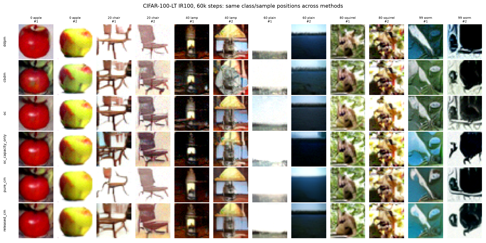

# Official discrete ImbDiff comparison matrix

This matrix is a reduced-budget, controlled CIFAR-100-LT IR100 comparison. It
uses the standard and capacity U-Nets vendored from ImbDiff-CM, the release's
discrete VP/DDPM schedule and DDIM samplers, and a shared 60,000-update protocol.
It is not a numerical reproduction of the release's 300,001-update result.

## Methods

| Method | Endpoint transfer | CM-capable U-Net | CM distance loss | Interpretation |
| --- | --- | --- | --- | --- |
| `ddpm` | no | no | no | ordinary conditional DDPM |
| `cbdm` | no | no | no | DDPM plus the CBDM distribution-adjustment loss |
| `oc` | yes | no | no | released endpoint-transfer method |
| `released_cm` | yes | yes | yes | the authors' released CM recipe |
| `pure_cm` | no | yes | yes | capacity manipulation without endpoint transfer |
| `oc_capacity_only` | yes | yes | no | controls for added capacity without the CM distance loss |

The released CM YAML sets `transfer_x0: true`. Thus `released_cm` is the
composition of endpoint transfer, the CM-capable U-Net, and the CM loss; it is
not the capacity-only intervention. The two additional ablations make the
components identifiable:

- `oc` versus `oc_capacity_only` measures the effect of the expanded model;
- `oc_capacity_only` versus `released_cm` measures the effect of the CM loss;
- `ddpm` versus `pure_cm` measures CM without OC transfer.

The ImbDiff-CM repository releases runnable OC and CM trainers but no CBDM
trainer. The CBDM row therefore implements Eq. (4) of Qin et al., *Class-
Balancing Diffusion Models* (CVPR 2023), directly in discrete epsilon space:
training-distribution auxiliary labels, `tau=0.001`, `gamma=0.25`, and the
paper's stop-gradient directions. It uses the same released standard U-Net,
DDPM schedule, data order, optimizer, EMA, and sampler as DDPM and OC.

## Shared 60k protocol

- CIFAR-100-LT exponential IR100 split, seed 0;
- batch size 64, Adam at `2e-4`, 5,000-step official warmup;
- 1,000 diffusion steps with linear beta `1e-4` to `0.02`;
- 60,000 updates, EMA `0.9999`, checkpoints at 20k, 40k, and 60k;
- 10,000 balanced conditional samples using 50-step DDIM;
- CFG `paper_omega=1.5` for the controlled first comparison;
- BF16 automatic mixed precision and channels-last on for feasible Blackwell
  throughput; compile off. Every method used the same runtime settings.

Guidance strength is a sampling-time parameter. After training, checkpoints can
be resampled at other guidance values without retraining; do not mix per-method
guidance tuning into the first controlled result.

## Configurations

All configurations are under `configs/cifar100_lt/autodl_matrix60k/`:

- `cifar100_lt_ir100_official_ddpm_60k.yaml`
- `cifar100_lt_ir100_official_cbdm_60k.yaml`
- `cifar100_lt_ir100_official_oc_60k.yaml`
- `cifar100_lt_ir100_official_released_cm_60k.yaml`
- `cifar100_lt_ir100_official_pure_cm_60k.yaml`
- `cifar100_lt_ir100_official_oc_capacity_only_60k.yaml`

Each run writes to a separate directory below
`/root/autodl-tmp/runs/imbdiff_matrix60k/`.

## Completed results

All six runs completed 60,000 updates without non-finite losses. Each final EMA
checkpoint produced 10,000 finite samples, exactly 100 for each of the 100
classes. The table below is the controlled seed-0 result; lower FID and KID are
better, while higher IS is better.

| Method | Overall FID | Many FID | Medium FID | Few FID | KID | IS |
| --- | ---: | ---: | ---: | ---: | ---: | ---: |
| `pure_cm` | **24.651** | **32.768** | **34.221** | **40.307** | **0.01323** | **10.306** |
| `released_cm` | 26.997 | 34.761 | 35.562 | 43.504 | 0.01646 | 9.751 |
| `ddpm` | 36.252 | 40.597 | 47.159 | 55.415 | 0.02535 | 10.162 |
| `oc` | 39.512 | 42.371 | 49.785 | 59.738 | 0.02897 | 9.487 |
| `oc_capacity_only` | 40.213 | 43.969 | 49.331 | 60.231 | 0.03012 | 8.986 |
| `cbdm` | 44.406 | 47.087 | 53.132 | 64.895 | 0.03311 | 8.004 |

### Component-level conclusions

- Capacity manipulation is the effective component at this budget. `pure_cm`
  improves overall FID by 11.602 (32.0%) over DDPM. Its improvement is larger
  for Medium (27.4%) and Few (27.3%) than for Many classes (19.3%).
- The conclusion is reproduced on top of OC: `released_cm` improves overall FID
  by 12.515 (31.7%) over `oc`, including a 16.234 Few-FID improvement.
- Low-rank parameterization alone is insufficient. `oc_capacity_only` is 0.701
  FID worse than `oc`, with no consistent split-level gain.
- At 60k, endpoint transfer is harmful: `oc` is worse than DDPM, and
  `released_cm` is 2.346 FID worse than `pure_cm`. This does not establish that
  OC remains harmful at the authors' 300k budget; it explains why pure CM is
  the best controlled result here.
- CBDM also underperforms DDPM at 60k. The reduced-budget matrix therefore
  reproduces the benefit of CM, but not the paper-scale ranking of every base
  objective.

These conclusions are consistent across overall FID, KID, and the three
frequency-group FIDs. The qualitative comparison below uses identical class
and within-class sample positions across methods.



## Evaluation protocol and preservation

The evaluation uses TensorFlow-FID-compatible Inception-v3 weights with SHA-256
`6726825d0af5f729cebd5821db510b11b1cfad8faad88a03f1befd49fb9129b2`.
One balanced 50,000-image CIFAR-100 training cache is shared by all methods.
Each metric uses all 10,000 generated samples. Many, Medium, and Few are the
frequency-ranked top, middle, and bottom thirds of the 100 classes.

This screen deliberately omits brute-force generative recall and 100 separate
classwise 2048-dimensional FIDs. It retains reference-compatible overall FID
and KID, pooled Many/Medium/Few FID, and Inception Score. `repeats=1` is used
because the complete 10,000-sample set is evaluated; it is not an estimate of
run-to-run uncertainty.

The small cross-device record is committed under
`docs/research/results/official_imbdiff_matrix60k/`:

- exact JSON metric reports for all six methods;
- class counts and a tabular summary;
- SHA-256 hashes and byte sizes for each large server artifact;
- the selected-sample comparison above.

Large checkpoints, samples, and feature caches remain under
`/root/autodl-tmp/runs/imbdiff_matrix60k/` on the server. The evaluation cache
occupies about 1.2 GB, while the complete six-run directory and caches occupy
about 16 GB. The manifest allows future copies to be verified without placing
those artifacts in Git.

The first method builds both caches:

```bash
python -m fm_lab.experiments.run_imbdiff_eval \
  --generated-samples /root/autodl-tmp/runs/imbdiff_matrix60k/ddpm/samples/official_ddim.npy \
  --generated-labels /root/autodl-tmp/runs/imbdiff_matrix60k/ddpm/samples/generated_labels.npy \
  --dataset cifar100 \
  --data-root /root/autodl-tmp/data/cifar100 \
  --weights /root/autodl-tmp/weights/imbdiff/pt_inception-2015-12-05-6726825d.pth \
  --feature-cache-dir /root/autodl-tmp/runs/imbdiff_matrix60k/evaluation/features \
  --class-counts /root/autodl-tmp/runs/imbdiff_matrix60k/evaluation/class_counts.json \
  --output-dir /root/autodl-tmp/runs/imbdiff_matrix60k/evaluation/ddpm \
  --device cuda --batch-size 512 \
  --repeats 1 --overall-samples 10000 \
  --skip-recall --skip-classwise-fid
```

Later methods pass the shared
`features/real_cifar100_balanced_train.npz` through `--real-cache` and use a
method-specific feature-cache directory. After the DDPM evaluation, its
generated cache can be moved into `features/ddpm/` while leaving the shared real
cache at the parent level.

## Interpretation boundary

The absolute FIDs are not directly comparable to the paper's 300,001-update,
50,000-generated-sample results. This matrix has one training seed, one-third
of the updates, and one-fifth of the evaluation samples. It supports a causal
within-matrix statement that the CM allocation loss is already effective at
60k; it does not establish converged method rankings or uncertainty across
training seeds.

The next stage is the checkpoint-based
[CM mechanism probe](research/imbdiff_cm_mechanism_probe.md), which tests
whether the learned expert branch actually receives frequency-dependent
head/tail specialization and whether that correction is spectrally selective.

## References

- [Capacity Manipulation for Imbalanced Image Generation](https://openreview.net/forum?id=wSGle6ag5I)
- [Authors' ImbDiff-CM release](https://github.com/Feng-Hong/ImbDiff-CM)
- [Class-Balancing Diffusion Models](https://openaccess.thecvf.com/content/CVPR2023/html/Qin_Class-Balancing_Diffusion_Models_CVPR_2023_paper.html)
