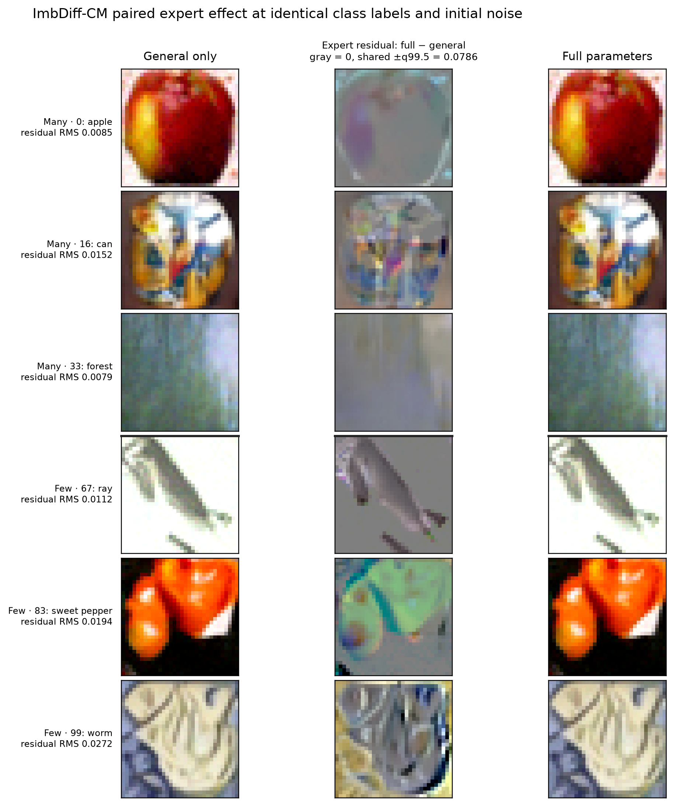

# CM matched end-to-end sampling screen

## Scope

This is the bounded end-to-end follow-up to the local causal expert
intervention. It uses the released-CM EMA checkpoint at 60,000 training steps
on CIFAR-100-LT IR100.

The six sampling conditions are:

1. learned expert;
2. general-only (all expert factors zero);
3. four singular-subspace-randomized experts.

All conditions use the same 2,000 balanced requested labels (20 per class),
initial Gaussian noise, deterministic DDIM schedule (`skip=20`), and guidance
weight (`omega=1.5`). Random experts preserve each layer's learned
singular-spectrum shape. Their global factor scales are calibrated by:

1. the target-free local response probe at \(t\in\{100,500,900\}\);
2. a separate one-sample-per-class DDIM pilot with a different initial-noise
   seed, matching random versus learned endpoint response RMS.

The final evaluation seed is `20260725`. Runtime was 4 minutes 55 seconds on
the current CUDA server. The complete server artifact is:

```text
/root/autodl-tmp/runs/imbdiff_matrix60k/
  cm_sampling_intervention_screen_r4_endpoint_matched
```

## Validation

- all conditions have identical label and initial-noise digests;
- all expert factors are restored bit-exactly after every condition;
- endpoint-calibrated random factor scales are
  `[0.5233, 0.5296, 0.3681, 0.6285]`;
- final learned-general RMS is `0.014292`;
- mean random-general RMS is `0.014874`, a residual mismatch of about 4.1%
  rather than the 55.9% excess under local-only calibration.

The independent pilot therefore removes most, but not all, of the
full-trajectory response-magnitude confound.

## KID screen

Lower is better. Positive gain/advantage means the learned expert is better.

| Group | Learned | General | Random mean | Learned gain vs general | Learned advantage vs random mean |
| --- | ---: | ---: | ---: | ---: | ---: |
| Overall | 0.016868 | 0.017469 | 0.017154 | +0.000601 | +0.000286 |
| Many | 0.016775 | 0.017385 | 0.017079 | +0.000611 | +0.000305 |
| Medium | 0.014784 | 0.015481 | 0.015145 | +0.000698 | +0.000361 |
| Few | 0.020330 | 0.020791 | 0.020491 | +0.000461 | +0.000162 |

The four random-orientation overall KIDs are:

| Random expert | KID | Relative to learned |
| --- | ---: | ---: |
| 0 | 0.016183 | -0.000685 (better) |
| 1 | 0.017189 | +0.000321 (worse) |
| 2 | 0.018153 | +0.001286 (worse) |
| 3 | 0.017090 | +0.000222 (worse) |

The learned expert is better than the mean and three of four random
orientations, but not every matched random orientation. Four rotations are
insufficient to estimate orientation-level uncertainty tightly.

## KID subset uncertainty

The evaluator exposes its 20 fixed KID subset draws. Because every condition
has aligned sample order and uses the same subset seed, their differences are
paired:

| Group | Gain vs general, 2.5–97.5% subset range | Positive draws | Advantage vs random mean, 2.5–97.5% subset range | Positive draws |
| --- | ---: | ---: | ---: | ---: |
| Overall | `[0.000406, 0.000788]` | 20/20 | `[0.000049, 0.000448]` | 19/20 |
| Many | `[0.000428, 0.000760]` | 20/20 | `[0.000075, 0.000473]` | 20/20 |
| Medium | `[0.000520, 0.000822]` | 20/20 | `[0.000153, 0.000497]` | 20/20 |
| Few | `[0.000308, 0.000574]` | 20/20 | `[0.000026, 0.000299]` | 20/20 |

These ranges quantify Monte Carlo variation of the KID estimator only. They
are not confidence intervals over training seeds, checkpoints, datasets, or
random expert orientations.

## Tail selectivity and spectrum

There is no tail-selective effect:

- learned gain versus general, Few minus Many: `-0.000149`;
- learned advantage versus random mean, Few minus Many: `-0.000143`.

Both point estimates are smaller for Few than Many classes.

The end-to-end learned-general image displacement is predominantly low
frequency:

| Band | Energy fraction |
| --- | ---: |
| Low | 0.6889 |
| Mid-low | 0.2449 |
| Mid-high | 0.0613 |
| High | 0.0043 |

The fractions are nearly identical across Many, Medium, and Few groups. The
explicit expert is therefore not behaving like a tail-specific
high-frequency-detail branch at this checkpoint.

## Paired pseudo-visualization



The figure uses frequency-quantile classes rather than visually chosen
classes: Many `[0, 16, 33]` and Few `[67, 83, 99]`. Within each class, it uses
the sample nearest the class-median learned-general residual RMS. Every row
shares its requested class and initial noise across the two sampling
conditions.

The middle column is the signed endpoint difference
\(x_{\mathrm{full}}-x_{\mathrm{general}}\), not an independently generated
image or a literal internal activation of \(\theta_e\). Neutral gray denotes
zero. All rows use the same robust display scale: the 99.5th percentile of
absolute residual channels over all 2,000 paired samples, `±0.0786` in the
model's `[-1,1]` image units.

Three observations are visible:

1. full and general-only images are almost identical at ordinary display
   contrast, consistent with the small endpoint RMS;
2. the amplified residual is spatially coherent and follows object regions,
   silhouettes, color fields, and boundaries rather than looking like
   unstructured pixel noise;
3. the selected tail examples often have larger residual RMS, but the
   groupwise KID benefit is smaller for Few than Many. Intervention magnitude
   therefore does not imply useful tail-specialized knowledge.

This supports the low-frequency, stage-composed correction interpretation.
It does not identify a separable semantic object or texture dictionary stored
inside the expert parameters.

## Conclusion

The learned expert makes a small but reproducible improvement over removing
the expert branch in this finite-sample KID screen. Its orientation is better
than the mean of four response-matched random orientations, but one random
orientation performs better, so the evidence is for a useful learned
correction rather than a uniquely identified expert subspace.

The effect is not tail-specialized: it is weaker for Few than Many classes and
is dominated by low spatial frequencies. This is more consistent with a
generic, stage-composed correction or regularization effect than with the
paper story that the low-rank branch stores specifically tail knowledge.

The same six-condition intervention has now been confirmed at 100 samples per
class with full FID. See
[`cm_sampling_intervention_fid10k.md`](cm_sampling_intervention_fid10k.md).
Learned improves over general-only by 0.930 FID and over the random mean by
0.685 FID, but random orientation 0 beats learned by 0.233 FID. The larger run
therefore strengthens the useful-general-correction conclusion without
establishing a uniquely learned or tail-specialized expert subspace.
